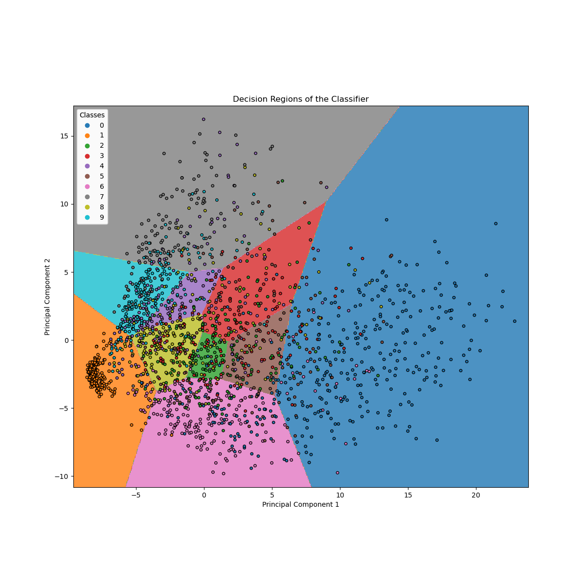

# Pattern Recognition

Projects for the course [Pattern Recognition](https://github.com/slp-ntua/patrec-labs) offered by the Master's program in *Data Science and Machine Learning* of the National Technical University of Athens.

The contents of the projects are:

1. MNIST digit images classification.
2. Spoken digits classification.
3. Song genre classification and regression on attributes like "danceability".

More detailed descriptions can be found in the README files in the directories of each project.
